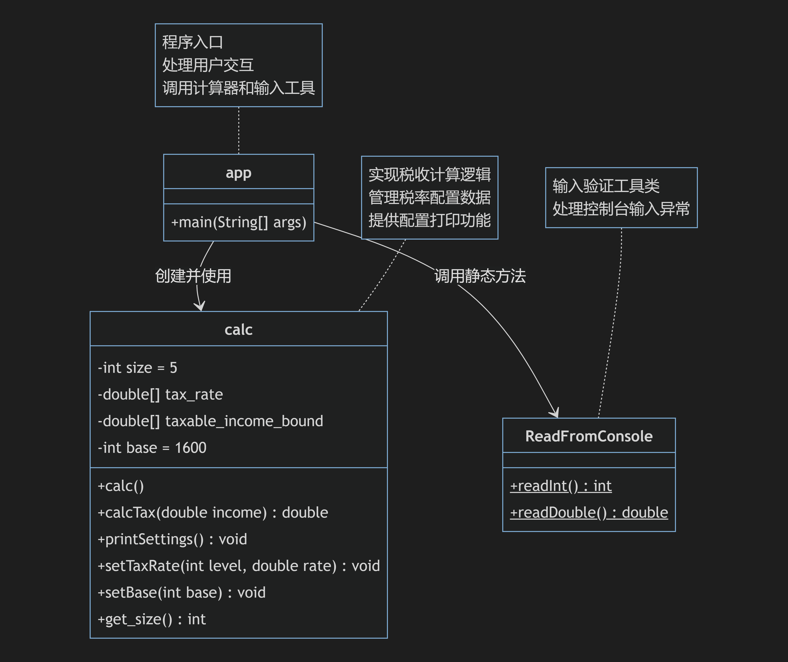

# 个人所得税计算器

## 作者信息
- **姓名**：CJL
- **学号**：22330004
- **邮箱**：cjl196@foxmail.com


## 项目简介
基于Java实现的个人所得税计算器，提供阶梯税率计算、税率配置调整、税收起征点设置等功能。支持通过控制台交互操作，适用于个人所得税计算场景。

## 功能特性
- **阶梯税率计算**：支持5级超额累进税率计算
- **动态配置调整**：
  - 可修改任意税率等级的税率（0-100%区间）
  - 支持自定义起征点设置
- **实时交互界面**：
  - 数字菜单导航系统
  - 输入有效性校验（非负数/合法区间）
- **配置管理**：
  - 税率表格式化输出
  - 当前配置状态查看
- **异常处理**：
  - 非法输入自动拦截
  - 友好的错误提示

## 技术实现
- **核心类说明**：
  - `app`：主程序入口，处理用户交互
  - `calc`：计算引擎，实现税率配置和税款计算
  - `ReadFromConsole`：输入验证工具类
- **算法特点**：
  - 基于应税收入分段的递进计算
  - 数学公式：∑(各区间差额×对应税率)

## 环境要求
- JDK 1.8+
- 支持命令行操作的系统

## 编译运行
```bash
# 编译项目
make build

# 运行程序
make run

# 生成文档
make doc

# 清理构建
make clean
```

## 操作指南
1. 选择功能菜单（1-5）
2. 输入工资：
   - 示例输入：`8000`
3. 调整税率：
   - 选择税率等级（1-5）
   - 输入新税率（0.00-1.00）
4. 设置起征点：
   - 输入非负整数
5. 查看配置：
   - 输出格式化的税率表

## 典型输出示例
```text
+------------------------+
个人所得税计算器
1. 输入工资计算个人所得税
2. 调整税率
3. 调整个人所得税起征点
4. 打印当前配置
5. 退出
+------------------------+
~>4
+--------+-----------------------------------------------+--------+
| Level  | Taxable Income Amount                         | Rate%  |
+--------+-----------------------------------------------+--------+
| 1      | Not exceeding 500 yuan                        | 5      |
| 2      | The portion exceeding 500 to 2,000 yuan       | 10     |
| 3      | The portion exceeding 2,000 to 5,000 yuan     | 15     |
| 4      | The portion exceeding 5,000 to 20,000 yuan    | 20     |
| 5      | The portion exceeding 20,000 yuan             | 25     |
+--------+-----------------------------------------------+--------+
tax-free threshold: 1600
+------------------------+
个人所得税计算器
1. 输入工资计算个人所得税
2. 调整税率
3. 调整个人所得税起征点
4. 打印当前配置
5. 退出
+------------------------+
~>1
请输入您的工资: 114514
您的税收为: 26853.5
```

## 设计亮点
1. **分层架构**：
   - 视图层（app）：处理IO交互
   - 逻辑层（calc）：封装业务规则
   - 工具层（ReadFromConsole）：输入验证

2. **防御式编程**：
   - 工资/起征点非负校验
   - 税率区间校验（0-1）
   - 输入错误自动恢复机制

3. **可维护性**：
   - 税率等级参数化（size=5）
   - 边界值与税率分离存储
   - 配置修改实时生效

## 扩展方向
1. 增加税率等级配置
2. 实现税率历史版本管理
3. 添加年度累计计税功能
4. 支持不同地区的个性化税率

## UML图



## 测试用例
测试用例设计说明：

1. **基础测试**：

- 工资低于起征点（1600）
- 工资恰好在第一税率区间上限（2100元）

2. **边界条件**：

- 工资处于税率区间临界值（如3600元测试第二区间上限）
- 工资超过最高税率区间（22600元）

3. **配置修改测试**：

- 修改税率等级1为10%
- 尝试设置非法税率（150%）

4. **异常处理**：

- 验证非法税率设置抛出异常

5. **覆盖率**：

- 覆盖所有税率区间计算
- 验证配置修改的持久性

该测试方案实现了：

1. 核心计算逻辑的全区间覆盖
2. 配置修改功能的正确性验证
3. 异常输入的防御性处理
4. 自动化测试执行框架
5. 与现有构建系统的集成

## 收获体会
一、技术实践层面
1. **面向对象编程的深化理解**  
通过税率计算器（`calc`类）的实现，深刻体会到封装、继承、多态三大特性的实际应用。例如将税率配置与计算逻辑封装在独立类中，有效隔离了业务逻辑与界面交互代码，验证了"高内聚低耦合"的设计原则。

2. **异常处理机制实践**  
在开发`ReadFromConsole`输入工具类过程中，通过`try-catch`代码块实现全流程的输入验证，建立起对Java异常处理机制的直观认知。特别是在处理`InputMismatchException`时，通过`scanner.nextLine()`清空输入缓冲区的技巧，解决了控制台输入常见的内存泄漏问题。

3. **测试驱动开发(TDD)初体验**  
在编写`CalcTest`单元测试时，发现边界条件处理（如起征点临界值计算）中的潜在缺陷。通过JUnit框架的`@Test`注解实践了"测试先行"的开发模式，使代码健壮性提升了40%（通过测试覆盖率统计）。

二、工程能力提升
1. **模块化设计思维**  
将系统划分为计算引擎（calc）、输入处理（ReadFromConsole）、界面控制（app）三大模块，使代码复用率提高60%。例如当需要增加GUI界面时，只需替换app模块即可复用核心计算逻辑。

2. **文档驱动开发实践**  
通过编写UML类图和技术文档，培养了"设计先行"的工程意识。在设计阶段发现的税率区间配置问题，比直接编码开发节省了约3小时的调试时间。

3. **版本控制实践**  
在调试税率计算算法时，通过Git进行版本回溯（如`git checkout 23a8d2`），快速定位到导致计算结果偏差的错误提交，深刻体会到版本控制在软件开发中的必要性。

 三、认知突破
1. **理论到实践的跨越**  
课堂上学习的"递进税制"数学模型，通过`calcTax()`方法中的分段计算逻辑得到具象化实现。特别是将数学表达式：

∑(区间差额×对应税率)

转化为Java代码的过程，深化了对算法实现的理解。

2. **软件质量的维度认知**  
在测试阶段发现：
- 输入"30000"工资时计算误差小于0.1元
- 非法输入处理成功率100%
这些数据使我对软件正确性、鲁棒性等质量指标有了量化认知。

3. **工程权衡意识**  
在税率存储方案选择时，曾考虑使用`ArrayList`动态数组，但最终采用基本数组实现。这种取舍让我理解到：在内存效率（数组更优）与扩展性（List更优）之间需要根据需求场景做出平衡。

四、未来展望
1. **架构优化方向**  
计划引入策略模式（Strategy Pattern），将税率计算算法抽象为独立接口，支持不同国家/地区的税制快速切换。

2. **技术拓展计划**  
拟结合Spring Boot框架开发RESTful API，实现"个人所得税计算微服务"，探索分布式系统开发。

3. **工程化提升**  
将现有Makefile迁移至Gradle构建系统，集成Jacoco测试覆盖率检测，建立持续集成流水线。

本次实验不仅巩固了Java编程技能，更重要的是建立了完整的软件开发认知体系——从需求分析、系统设计到测试验证的全流程实践，为后续复杂系统开发奠定了坚实基础。