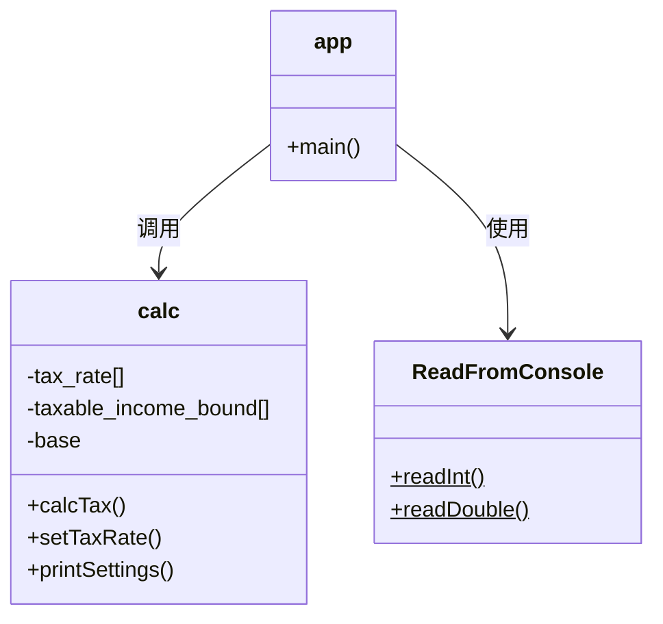

# 个人所得税计算系统设计文档

## 一、系统概述
### 1.1 设计目标
本系统采用模块化设计原则，实现具备以下特性的个人所得税计算解决方案：
- 阶梯式税率计算功能（5级超额累进）
- 动态税率配置管理
- 交互式控制台界面
- 工业级输入验证机制

### 1.2 设计原则
1. **单一职责原则**：每个类/方法只承担单一功能
2. **开闭原则**：税率计算核心算法支持扩展
3. **迪米特法则**：模块间保持最小耦合度
4. **防御式编程**：全链路输入校验

## 二、类结构设计
### 2.1 类关系图


### 2.2 核心类说明
#### 2.2.1 calc（计算引擎）
**职责**：实现税率计算核心逻辑

| 成员          | 类型   | 说明                      |
|---------------|--------|-------------------------|
| tax_rate      | double[] | 税率配置数组（5级）        |
| taxable_income_bound | double[] | 应税收入边界（4个区间上限） |
| base          | int    | 个税起征点                |

**关键方法**：
```java
public double calcTax(double income) {
    // 实现分区间累进计算
    if (income <= base) return 0;
    double taxable = income - base;
    
    // 分段计算逻辑
    if (taxable <= 500) {
        return taxable * 0.05;
    } else if (taxable <= 2000) {
        return 500*0.05 + (taxable-500)*0.10;
    }
    // ...其他区间计算
}
```

#### 2.2.2 ReadFromConsole（输入处理器）
**职责**：实现控制台输入验证

| 方法                | 功能说明                   |
|---------------------|--------------------------|
| readInt()           | 获取合法整数输入（32位）   |
| readDouble()        | 获取合法浮点数输入（64位） |

**输入验证流程**：
1. 循环检测输入有效性
2. 捕获InputMismatchException
3. 清空错误输入缓冲区
4. 提示重新输入

#### 2.2.3 app（主控模块）
**职责**：用户界面与流程控制

**运行时序**：
1. 初始化计算引擎
2. 显示交互式菜单
3. 根据选择调用对应功能
4. 循环直到退出

## 三、核心算法
### 3.1 阶梯税率算法
**数学表达式**：
```
tax = ∑(interval_i × rate_i)
```
其中：
- interval_i = min(应税收入, 本区间上限) - 前区间上限
- rate_i = 对应区间税率

**执行流程**：
```text
         +---------------+
         | 输入工资收入   |
         +-------+-------+
                 |
         +-------v-------+
         | 扣除起征点    |
         +-------+-------+
                 |
         +-------v-------+
         | 区间匹配计算   |
         +-------+-------+
                 |
         +-------v-------+
         | 分段累加税款  |
         +-------+-------+
                 |
         +-------v-------+
         | 返回最终结果  |
         +---------------+
```

## 四、异常处理机制
### 4.1 防御层级
| 层级       | 防护措施                          |
|------------|---------------------------------|
| 输入层     | ReadFromConsole类全量校验        |
| 业务逻辑层 | calc类参数范围检查               |
| 系统层     | JVM异常捕获（NumberFormat等）    |

### 4.2 典型异常处理
```java
// 在ReadFromConsole中
try {
    number = scanner.nextInt();
} catch (Exception e) {
    System.out.println("输入无效，请输入一个32位整数！");
    scanner.nextLine(); // 清除错误输入
}
```

## 五、测试策略
### 5.1 测试用例矩阵
| 测试类别     | 用例示例                     | 预期结果          |
|-------------|----------------------------|------------------|
| 边界值测试   | 工资=起征点±1              | 正确计算0/最低税款 |
| 区间跳变测试 | 工资=各税率区间临界值±1     | 正确分段计算      |
| 异常流测试   | 输入非数字/负数/超范围数值  | 提示重新输入      |

### 5.2 自动化测试
```java
// 使用JUnit进行单元测试
@Test
public void testTopBracketTax() {
    calc c = new calc();
    double tax = c.calcTax(25000);
    double expected = 500*0.05 + 1500*0.10 
                    + 3000*0.15 + 15000*0.20 
                    + 5000*0.25;
    assertEquals(expected, tax, 0.001);
}
```

## 六、扩展性设计
### 6.1 可扩展点
1. **税率等级扩展**：
   - 修改calc类size常量
   - 更新tax_rate和taxable_income_bound数组

2. **国际化支持**：
   - 创建Locale配置文件
   - 实现多语言税率表

3. **持久化存储**：
   - 添加配置文件读写功能
   - 实现税率配置导入/导出

### 6.2 性能优化

优化前：每次计算遍历所有税率区间
优化后：二分查找定位税率区间
时间复杂度：O(n) → O(log n)

